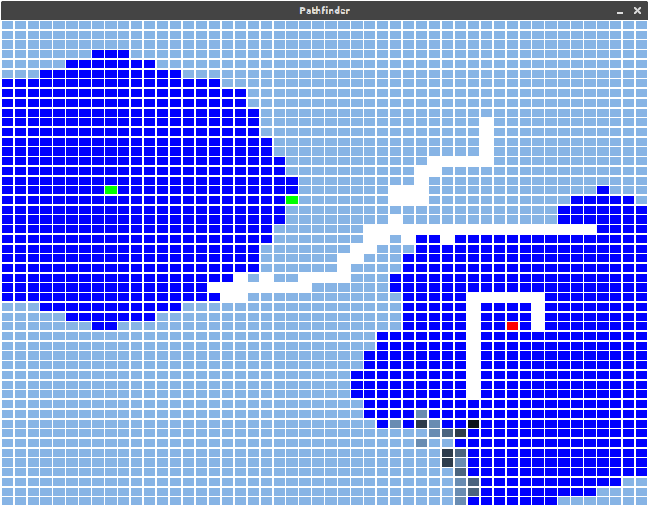

# Pathfinder
Pathfinding algorithms with graph creator and visualizations



## Features

### Graph creators
- Matrix

### Algorithms
- A* (configurable heuristic)
- Best First Search
- Bidirectional A* (configurable heuristic)
- Breadth First Search
- Dijkstra

### Heuristics
- Euclidean
- Manhattan

## Usage
```python
python pathfinder.py [matrix_name] [cols] [rows]
```

## Keymap
Left mouse button: Increase block cost

Right mouse button: Decrease block cost or remove block if cost < 0

Middle mouse button: Place start / end

Enter: Run visualizations